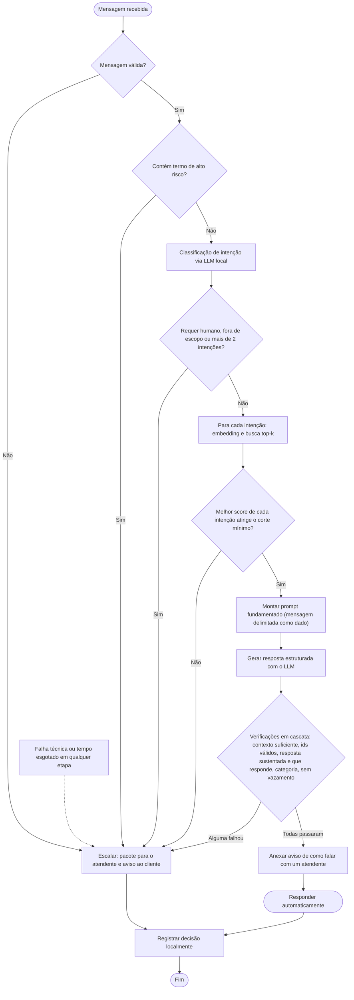

# Fluxograma do pipeline

```mermaid
flowchart TD
    A(["Mensagem recebida"]) --> B{"Mensagem válida?"}
    B -- "Não" --> ESC
    B -- "Sim" --> C{"Contém termo de alto risco?"}
    C -- "Sim" --> ESC
    C -- "Não" --> D["Classificação de intenção via LLM local"]
    D --> E{"Requer humano, fora de escopo ou mais de 2 intenções?"}
    E -- "Sim" --> ESC
    E -- "Não" --> F["Para cada intenção: embedding e busca top-k"]
    F --> G{"Melhor score de cada intenção atinge o corte mínimo?"}
    G -- "Não" --> ESC
    G -- "Sim" --> H["Montar prompt fundamentado (mensagem delimitada como dado)"]
    H --> I["Gerar resposta estruturada com o LLM"]
    I --> J{"Verificações em cascata: contexto suficiente, ids válidos, resposta sustentada e que responde, categoria, sem vazamento"}
    J -- "Alguma falhou" --> ESC
    J -- "Todas passaram" --> K["Anexar aviso de como falar com um atendente"]
    K --> L(["Responder automaticamente"])
    L --> LOG["Registrar decisão localmente"]
    ESC["Escalar: pacote para o atendente e aviso ao cliente"] --> LOG
    ERR["Falha técnica ou tempo esgotado em qualquer etapa"] -.-> ESC
    LOG --> Z(["Fim"])
```
